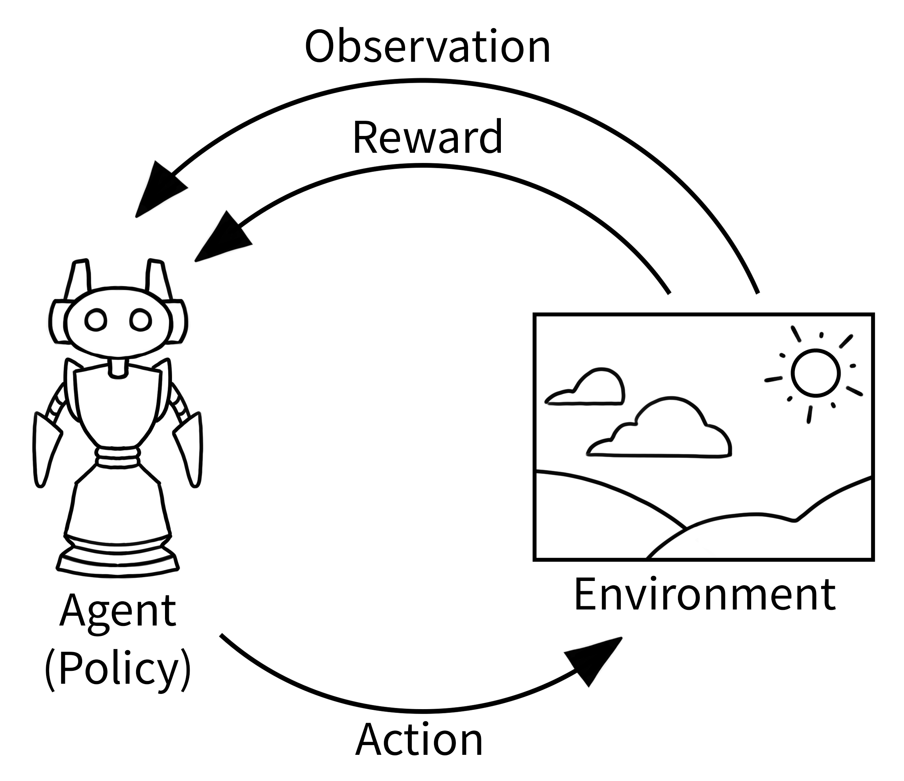

# Bayesian-and-Kalman-filtering
Bayesian and Kalman filtering matlab and python implementation

## KF fitter
### picture

#### test
参考：忠厚老实的王大头

两个传感器对同意状态进行观测，使用kf

这是一段用Kalman Filter滤波的Matlab程序，其基本思路是：首先生成一个含有噪声的信号，然后对其进行KF滤波，使得噪声得到一定程度的削减，从而还原出原信号。具体实现中，使用了状态方程和观测方程，根据状态方程和观测方程来设定F、H、Q、R这四个矩阵，并通过计算KF滤波的五大公式来实现滤波。程序的最后一段是用不同颜色的线条展示出原信号、观测信号和滤波之后的信号，方便直观的比较三者的差异。

KF：matlab实现用计算机生成一个含正态噪声的信号，并用KF滤波

KF_sensor_fusion: matlab实现生成两个含正态噪声信号并用KF滤波

main.py: python实现KF_sensor_fusion

